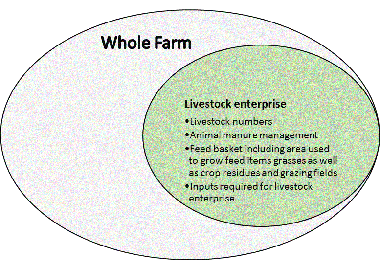

<style>
body {
text-align: justify}
</style>

# <span style="color: blue;">Technical Manual and User Guide </span>{-}

```{r setup, include=FALSE}
knitr::opts_chunk$set(echo = FALSE)
```

International Center for Tropical Agriculture (CIAT), Nairobi, Kenya

```{r logo, echo=FALSE, out.width= "80%"}

```

\newpage

# <span style="color: blue;">Contents </span>

```{r Acroynm}
Acronym_list <- tibble::tribble(
       ~AME,                                                                                                                                                ~Adult.Male.equivalent,
        "α",                                                                                                                                                               "alpha",
      "NH3",                                                                                                                                                             "Ammonia",
      "Bha",                                                                                                                                                    "Baseline hectare",
        "β",                                                                                                                                                                "Beta",
       "BD",                                                                                                                                                        "Bulk density",
       "Cl",                                                                                                                                                    "calving interval",
     "CO2e",                                                                                                                                           "Carbon dioxide equivalent",
  "CLEANED", "Comprehensive Livestock Environmental Assessment for Improved Nutrition, a Secured Environment    and Sustainable Development along Livestock and Fish Value Chains",
       "CP",                                                                                                                                                       "Crude Protein",
       "DE",                                                                                                                                                   "Digestible Energy",
       "DM",                                                                                                                                                          "Dry Matter",
       "EF",                                                                                                                                                     "Emission Factor",
       "ET",                                                                                                                                                  "Evapotranspiration",
     "FPCM",                                                                                                                                          "Fat-Protein Corrected Milk",
      "ft.",                                                                                                                                                                "Feet",
      "FAO",                                                                                                                                   "Food and Agriculture Organization",
      "GWP",                                                                                                                                            "Global Warming Potential",
      "GHG",                                                                                                                                                     "Green House Gas",
       "GE",                                                                                                                                                        "Gross Energy",
       "ha",                                                                                                                                                             "hectare",
     "IPCC",                                                                                                                           "Intergovernmental Panel on Climate Change",
     "kcal",                                                                                                                                                         "kilocalorie",
       "Kg",                                                                                                                                                            "Kilogram",
       "Km",                                                                                                                                                           "Kilometre",
      "LWG",                                                                                                                                                    "Live Weight Gain",
       "MJ",                                                                                                                                                          "Mega joule",
       "ME",                                                                                                                                                "Metabolizable Energy",
       "MP",                                                                                                                                               "Metabolizable Protein",
      "CH4",                                                                                                                                                             "Methane",
        "m",                                                                                                                                                               "metre",
       "mm",                                                                                                                                                          "millimetre",
      "NPV",                                                                                                                                                   "Net present value",
        "N",                                                                                                                                                            "Nitrogen",
      "N2O",                                                                                                                                                       "nitrous oxide",
   "NUTMON",                                                                                                                                                 "Nutrient monitoring",
       "PC",                                                                                                                                                     "Protein content",
      "ROI",                                                                                                                                                "Return on investment",
       "SD",                                                                                                                                                          "Soil depth",
      "SOC",                                                                                                                                                 "Soil Organic Carbon",
        "t",                                                                                                                                                                "Time",
      "TVP",                                                                                                                                           "Total value of production",
      "USD",                                                                                                                                                "United States Dollar",
       "UE",                                                                                                                                                      "Urinary Energy"
  )

```

\newpage

# <span style="color: blue;">Preface </span>

The production of livestock products has heavily influenced how we utilize land and an important avenue for livelihoods across our planet. However, the sector utilizes a big portion of our natural resources and causes negative environmental impacts such as land degradation, air and water pollution, greenhouse gas emissions and the decline in biodiversity. It is thus important to design sustainable livestock systems that work for people, communities and the planet. 

The purpose of this user guide and manual is to show and demonstrate how CLEANED works and the calculation behind the assessments. This is a model which assess several environmental impacts of livestock enterprises along a value chain. The model is a culmination of work over several years from experts across different disciplines and organizations and initial funding from CLEANED LVCs project funded by the Bill and Melinda Gate Foundation (DCE23232) and further supported by the BBSRC (BB/L026503/1) and the CGIAR Research Program on Livestock. We would like to thank partners and colleagues at Commonwealth Scientific and Industrial Research Organization (CSIRO), International Livestock Research Institute (ILRI) and Stockholm Environment Institute (SEI) who were fundamental in developing CLEANED. 

After reading this document you should be familiar with how CLEANED works and be able to carry out your own assessments on livestock enterprises. You will also have the general knowledge of the workings of the model and the calculations behind it. 

**What this manual and user covers** 

This document is divided into five parts: 

1.	Overview: This explains the limitations and boundaries of the assessments

2.	Inputs sheet: Which is a step by step guide on what data you will require to carry out and assessment

3.	Result sheets: These give an overview of the quantified results across different multiple environmental impacts

4.	Parameter sheets: This highlights the different parameters that are needed to meet the requirements for the specific livestock enterprise you are modeling

5.	Calculations: You are given a walk through on the background calculations needed to carry out the ex-ante assessment

**What you need for this manual and user guide** 

**CLEANED** is an open access model and can be downloaded from [here](https://doi.org/10.7910/DVN/G0G8IY). This model was developed with Microsoft Excel, Version: 2016. For this reason, users must have Microsoft Excel, Version: 2016 or 2019 to be able to run it. Please note with older versions this model will not work to its full capability.

**Who are the users**

This guide is intended to those who wish to carry out environmental impacts assessments on livestock enterprises using CLEANED, this includes but not limited to policy makers, research scientist and project managers.

**Application of the model**

The tool has been used on different livestock enterprises in different regions, Kenya, Tanzania and Nicaragua

Osele V; Paul B; Mukiri J; Halder S; Sagala T; Juma A; Notenbaert A. 2018. Feeding a productive dairy cow in western Kenya: environmental and socio-economic impacts. Working Paper. CIAT Publication No. 472. International Center for Tropical Agriculture (CIAT). Nairobi, Kenya. 48 p. Available at: [https://hdl.handle.net/10568/97557](https://hdl.handle.net/10568/97557)

\newpage

Hoek, R. van der., Birnholz, C. and Notenbaert A.M.O. 2016. Using the CLEANED approach to assess environmental impacts in the dual-purpose cattle value chain in Nicaragua. Livestock and Fish Brief 20. Nairobi: handle: 10568/78473 [http://hdl.handle.net/10568/78473](http://hdl.handle.net/10568/78473) 

Notenbaert, A.M.O., Morris, J., Pfeifer, C., Paul, B., Birnholz, C., Fraval, S., Lannerstad, M., Herrero, M. and Omore, A.O. 2016. Using the CLEANED approach to assess environmental impacts in the dairy value chain in Tanga, Tanzania. Livestock and Fish Brief 21. Nairobi handle: 10568/78475 [http://hdl.handle.net/10568/78475](http://hdl.handle.net/10568/78475)

**Conventions**

In this document, you will find a number of text styles that distinguish between different kinds of information. Here are some examples of these styles and an explanation of their meaning.

-	When referring to the model ““ will be used e.g “Inputs” sheet. 
-	When presented with → IMPORTANT NOTE: short guidance on what no to do. 
-	All equations are in *italics*

**Errata**

Even though we have taken great care to ensure our material is correct, mistakes do happen. If you notice a mistake in this document, we would be grateful if you could report it to us.

To this email address:[j.mukiri@cgiar.org](j.mukiri@cgiar.org)

\newpage

# <span style="color: blue;">Overview</span>

CLEANED is a static based model which assess multiple environmental impacts (Figure 3) of a livestock enterprises on an annual basis. CLEANED was developed on Microsoft excel 2016 and implemented as an excel work book. The model is used to carry out rapid ex-ante impact assessments with the data input requirements kept to a minimum. To read more on the framework behind CLEANED you can read from [here.](http://hdl.handle.net/10568/56664)

The boundary for assessment extends to all the inputs needed to sustain the livestock enterprise but not the whole farm,Figure 1.  This includes the area and other inputs used for feed grown for feeding the livestock, including crops whose residues are fed. It does not include the whole farm area or crops grown on the farm that are not fed to the animals Figure 2.

→ IMPORTANT NOTE: this model, models livestock enterprise for ruminants.

```{r enterprise, echo=FALSE, fig.cap= "Figure 1: Boundary for assessing a livestock enterprise", out.width="50%"}

```

\newpage

```{r example enterprise, echo=FALSE, fig.cap= "Figure 2: Marinana Ruffino (2004), example of a livestock enterprise",out.width= "80%"}

```

Based on the “minimum data entry”, the tool calculates the environmental footprint of a livestock enterprise, in terms of:

+ The area of land required for feed production
+	Productivity
+	Economics
+	Soil impacts:
       - Erosion
       - N balance
+	GHG emissions
+	Water Impacts

```{r indicators,echo=FALSE, fig.cap= "Figure 3: Multiple impact pathways assessed in CLEANED", out.width= "50%"}

```

\newpage

```{r Cleaned architecture, echo=FALSE, fig.cap= "Figure 4: Architecture of CLEANED"}

```

Figure 4 gives the architecture of the model, Figure 5and Figure 6 shows structure of the model as seen in excel:

+	The first sheet – the blue one -  is the sheet where you provide your input data, i.e. the description of the livestock enterprise. 

+	The next seven sheets – the red ones- are the results sheets:

    - The first six give you detailed results in terms of (i) land requirements, (ii) productivity, (iii) economics (iv) soil impacts (v) GHG emissions and (vi) water Impacts
    
    -	The last one gives you a quick overview or summary of all results
    
+	The eight grey sheets contain the parameters.  These are only to be accessed by more advanced users, e.g. for setting up the model for use in a different region 

+	The fifteen green sheets are where the calculations are implemented; they are not intended to be altered by users, they are only provided for expert users who wish to understand exactly how the impacts are being calculated.

The user must first construct the livestock enterprise based on the input data required which will be further discussed in section 4. The model works by first putting in data for a baseline livestock enterprise that you are assessing. After which the excel model automatically calculates environmental, climate and economic impacts.  The user can explore the results on the red results sheets.

CLEANED is meant for users to assess how these impacts would change through the introduction of a new technology or an altered livestock production configuration. In order to do so, the user first presses the *“save baseline”* button which saves the baseline input. The user can then change input values and add economic information needed discussed in section 4 and compare the new output with the baseline values. To run more scenarios, the user can run the scenario manager discussed in section 4. 

\newpage

```{r input sheet, echo=FALSE, fig.cap= "Figure 5: The inputs sheet"}

```

\newpage

```{r Extra cost, echo=FALSE, fig.cap= "Figure 6 : The additional input data required to calculate the economic cost or benefits of intervention scenarios"}

```

\newpage

# <span style="color: blue;">Inputs sheet</span>

<span style="text-decoration:underline">**Introduction:**</span>

The “inputs” sheet is where you, as a user, describe the current livestock keeping practice.  This description covers (i) the agro-ecological context, (ii) the livestock herd, (iii) livestock feeding practices, and (iv) how the feed items are produced. At the end of the sheet, users are required to provide information on the extra cost associated with an intervention scenario (this is only required when evaluating costs for new interventions). This is needed to calculate the economic cost/benefit indicators. 

As mentioned in section 3 the model  is limited to the livestock enterprise only.  E.g. it will not be necessary to input any data on the fruits or vegetables that are grown on the farm but not fed to the animals.

For each of the sub-sections, you are asked to fill a number of tables with specific values for a variety of different characteristics.  You only have to fill the cells that are shaded in pale green.  If the cell is white, the value is calculated on the basis of values you have provided in the parameters. 

The livestock enterprise data provided in this sheet can be a real farm observation or the description of a typical or average livestock enterprise. In the latter case, data can be sourced from querying farm-level surveys or expert opinion.

```{r Agroecological data, echo=FALSE, fig.cap= "Figure 7 CLEANED Farm Info and Agro ecological info"}

```

<span style="text-decoration:underline">**Farm info:**</span>

Before getting into the description, you are asked for a farm code and a farm name.  

You are then asked to specify the start and the end of up to two plant growing seasons or “wet seasons” Figure 7. This is the basis for calculating season length ^[Planting date is based on the period in which the animals are feed a wet season basket and a dry season basket]

+	Planting date long rain: the day of the year when planting starts in the first wet season

+	Harvest date long rain: the day of the year when harvesting starts in the first wet season 

+	Planting date short rain: the day of the year when planting starts in the first wet season

+	Harvest date short rain: the day of the year when harvesting starts in the first wet season

\newpage

<span style="text-decoration:underline">**Livestock:**</span>

```{r livestock data, echo=FALSE, fig.cap= "Figure 8: Livestock information required"}

```

In this section (Figure 8 ) you are asked to provide a wide array of information about the livestock herd; from livestock numbers, meat and milk production and their where-about up to the management of the manure.  The feeding practices are, however, included in a separate section.  

The first table “Livestock numbers, whereabouts, manure use” has a separate line for each of the pre-defined livestock types: local dairy cows, improved dairy cows, adult male cattle, steers/heifers, calves, sheep, goats and pigs.

For each of these types, you are asked to provide values for:

+	Herd composition: the number of animals in this category
+	Annual milk production: the total annual milk production (taking into account variances due to lactation period, etc.).  This information is only provided for the relevant livestock types (e.g. not for the calves or the male cattle)
+	The next four columns solicit information about the whereabouts of the animals.  This information is used in the GHG emission calculations.  All times are expressed as “fractions”.  E.g. if half a day is typically spent in the stable, the value listed under “time spent in the stable” should be 0.5. This number is an annual average across wet and dry seasons. The total time spent should add up to 1:

    -	Time spent in the stable: the fraction of the day that an animal of this type normally spends inside a stable; a stable is any structure where there is some form of closed space, and where the manure that is produced by the livestock remains away until it is collected and displaced.
    
    - Time spent in yard: a yard is therein defined as an enclosure or tethering area not too far from the house where the manure produced in that area is subject to the elements
    -	Time spent grazing on-farm pasture or stubble/residue on an on-farm crop field
    
    -	Time spent grazing off-farm:  the value in this column is calculated from the values you have input in the previous three columns.  It is assumed that all time not spent in the stable, the yard or grazing on-farm, is spent grazing off-farm.
 
\newpage 
    
+	Distance stable/enclosure to pasture (km): average distance between stable /enclosure and grazing grounds. This should be set to zero if no time is spent grazing.

+	The next set of columns is about manure, i.e. (i) how much is collected and (ii) how much of the collected manure is used to fertilize crops. Again, the input is not required in absolute figures but in fractions. In this case, the fractions do not need to add up until 1 across types but can be between 0 and 1 for each type.

    -	Collection of manure in stable: which fraction of the manure that is produced in the stable is collected vs. left on the floor
    
    -	Collection of manure in yard: which fraction of the manure produced in the yard is collected vs. left on the soil
    
    -	Collection of manure in on-farm fields/pasture: which fraction of the manure produced in the field or on the pasture is collected vs. left on the soil
    
    -	On-farm manure used as fertilizer: Here you are asked to indicate which fraction of the collected manure is used as fertilizer (vs. other uses such as fuel or building material).

In the manure management system table, you are asked to specify the manure management system for the manure collected from (i) stable, (ii) yard and (iii) pastures/fields. You can pick from a drop-down list; the choices include: 

+	Solid storage: The storage of manure, typically for a period of several months, in unconfined piles or stacks. Manure can be stacked due to the presence of sufficient bedding material or loss of moisture by evaporation. 
    
+	Dry lot: A paved or unpaved open confinement area without any significant vegetative cover where accumulating manure may be removed periodically. 
    
+	Pasture/range/paddock: The manure from pasture and grazing animals is just deposited and not managed. 

In the next table, the last set of information about manure and other organic inputs is been requested:

+	Annual purchase of animal manure: if manure is bought, indicate here how much.  This is expressed in kg N/year ^[Manure contains roughly 3% of N ]. 
.  
+	Annual purchase of compost: if compost is bought, indicate here how much. This is expressed in kg N/year. 

+	Annual purchase of other organic N additions: if any other organic sources of N are bought, indicate here how much in kg N/year.

+	Annual purchase of bedding materials: if bedding materials such as straw are bought, please indicate the amount in kg N/year.

+	Annual “sales” of home-produced manure: If manure leaves the farm, either through sale or gift, please indicate the amount in kg N/year.

The last table in this section indicates global milk and meat wastes/losses in the various value chain components (in percentages)

\newpage

+	waste/losses –production
+	waste/losses – distribution
+	waste/losses – processing
+	waste/losses – consumption
+	Total: total waste/losses along the value chain 

<span style="text-decoration:underline">**Livestock Feeding:**</span>

In this section (Figure 9), a fairly detailed description of the feed baskets for each of the livestock types is required.  Differentiation is made between wet and dry season feed baskets. Feed baskets are described in terms of their composition, i.e. the different feed items that are fed to the animals and the percentage of each feed item of the total feed basket.

The feed basket that you are required to describe first is the one for the wet season.  The wet season is defined based on the planting and harvesting dates you provided above. The rest of the year is considered to be dry season.  The wet season feed baskets for the different livestock types are listed on the left – column C to K; the dry season feed baskets on the right – columns M to U.

You start by selecting up to a total of seven different feed items over a period of one year.  You simply pick the relevant ones from the drop-down lists that are found just below the sub title “Wet season” in column B.  If a feed item is missing in the dropdown list given, the user may proceed to feed parameters sheet and replace the new item with another feed item which is of no interest in the livestock enterprise ^[If feed parameter is added it is important to note you must include a crop parameter].  In the cell under the selected feed item, you indicate the percentage of the total feed basket that is made up by this feed item.  This percentage is in terms of” as fed”/fresh weights. Make sure the percentages add up to 100%.

   →	IMPORTANT NOTE: You should list all feed items that are used on the farm;       independent of livestock type or season.  The list of items selected in         the wet season basket for local dairy cows will be repeated for the other       livestock types and for the dry season.  The only changes you can make in       those sections of the feed basket table are the percentages.  Zeros are         thus allowed.

```{r livestock feed, echo=FALSE, fig.cap= "Figure 9: Livestock data required"}

```

<span style="text-decoration:underline">**Feed production:**</span>

This section gathers information about the way the feed items are produced Figure 10.

\newpage

```{r feed production data, echo=FALSE, fig.cap= "Figure 10: Feed production data required"}

```

In the first table, crop areas and residue management, you will see the list of selected feed items and their associated crop. For each of these you are required to indicate if the main product or the residue is used in the feed basket.  The next three columns required to be filled are used in the erosion calculations. The user selects from drop down menus:

•	Crop product: indicate whether the feed is the Main crop, crop Residue or Purchased (i.e. concentrate)

•	Intercropping: indicate whether the feed is intercropped with another crop (e.g., legumes with cereals)

•	Fraction of field occupied if intercropped

-	Land cover: depends on the crop. i.e. for beans the cover crop is “pulses”. In most cases, the user will select among “maize, cereals, pulses, dense or degraded grass”. In the case of tuber crops, it is suggested to select either “cereals “or “pulses”. 

-	Slope: this is an estimation of the degree of the slope from flat to extremely steep. 

-	Length of slope: average estimate (in m)

The table shown in Figure 10 is based on harvesting of feed or crop and management of crop residues. For removals, provide:

-	Main product removal: if main crop is feed: the fraction of the crop that is removed from the field for feeding animals.

-	Crop residue removal from field: if crop residue is feed: the fraction of the crop residues that is removed from the field for feeding animals.

-	Crop residue burnt: the fraction of the total produced crop residues that is burnt
 
\newpage 
 
In the crop input table, provide:

+	For each crop associated with feed items:

    -	Fertilizer rate: this is expressed in kg N/ha and thus requires conversions from the fertilizer type and respective N contents this information is used for calculating nutrient balances and N2O emissions from each field

    -	Application of organic fertilizer: fraction of purchased/collected used for each feed crop. Sum must be 1.
    
    -	Purchased inorganic fertilizers: fraction of purchased inorganic fertilizer used, the model uses this to calculate greenhouse gas emissions from fertilizers. Sum must be 1.

The above information should correspond to each other, but the model asks for the type of fertilizer as the emissions from fertilizer itself depends on the production process, so we cannot calculate from the N rate only.

The last table of the input sheet, rice, only needs to be filled if one of the feed items is sourced from on-farm rice production:

-	Harvest area: calculated from the information provided above
-	Cultivation period: number of days the rice cultivation takes
-	Rice ecosystem type: select from the drop-down list
-	Water regime prior to rice cultivation: select from the drop-down list
-	Organic amendment inputs: select from the drop-down list
-	Rate of application: filled out based on information provided above

<span style="text-decoration:underline">**Save Baseline**</span>

After you have filled out the farm info, livestock, livestock feeding and feed production sections, you can explore the environmental footprint for this so-called “baseline” setup of the livestock enterprise

If you are sure the input data is correct, you can save it by pressing the “save baseline” button and get ready to run “scenarios”. 

After “Save Baseline”, insert the modifications in the Scenario model, make sure do not make changes into the baseline workbook. This workbook should remain open in the background but you should not make any scenarios or changes here.  

<span style="text-decoration:underline">**Extra Cost ‘Only to be filled for scenarios’:**</span>

These tables shown in Figure 11 are only to be filled when the user is implementing scenarios and wants to analyse the economic cost/benefit of the implementation of a new technology or alternative livestock production setup.

The first table solicits information about the costs associated with improvements in the existing herd. 

The user will add the extra operational costs and days of labor that would be needed to maintain those animals that were already there in baseline setup and remain so under the scenario. A small box is added to describe what the user has implemented.

The second table assumes that the user adds new livestock to his or her enterprise. Here the user is expected to put in:

-	The one-off cost associated with adding or removing the animals of the different categories to the herd (e.g. market price, cost of artificial insemination). 

-	The operational (i.e. annually recurring) cost that would be required to maintain the animals using the new technology. 

-	The extra one-off days of labour. 

-	The operational days of labour that would be needed to maintain the animal.

-	A short description of what the user has implemented.  

\newpage

The third table solicits information about extra costs associated with feed items that are also in the animal’s baseline diet.  The user will add the extra on-off/establishment costs and days of labour in the case of an increase in area, as well as the operational costs and days of labour needed to cover the changed management (e.g. application of fertilizer) or increase in area planted of the feed items. A small box is added to describe what the user has implemented.

The fourth table lists those feed items that the user has added as new feeds to the animal’s baseline diet ^[Scenario and baseline feed items need to be listed in the same order; as we compare item 1 with item 1 through to item 7 if the feed is not being replaced with a new feed item into the diet. ] . Here the user is expected to put in:

-	The one-off/establishment cost for the new technology (e.g. new feed). 

-	The operational cost that would be required to maintain the feed items on an annual basis.

-	The extra one-off days of labour. 

-	The operational days that would be needed to maintain the feed item.

-	A short description of what the user has implemented.

The last table leaves the option for any additional changes the user would want to implement, changes that are not associated with changing herd composition or feeding strategies.  This could, for example, be the construction of a feed trough or animal shed. Here the user is expected to put in:

-	The one-off cost for the new technology that has been used to improve animal productivity. 

-	The operational cost that would be required to maintain the new technology. 
-	Extra one-off days of labour. 

-	The operational days that would be needed to maintain the new investment. 

-	A short description of what the user has implemented

\newpage

```{r additional data, echo=FALSE, fig.cap= "Figure 11: The additional input data required to calculate the economic cost or benefits of intervention scenarios"}

```

<span style="text-decoration:underline">**Scenario manager**</span>

“Scenario manager” is a built-in Excel tool that allows users to deal with changing up to 32 variables (cells) simultaneously. It can be accessed from the 'Data' tab on the Ribbon and is located using the 'What-If Analysis' icon in the Forecast' section. 

Advantages of using this tool are:

•	Allows multiple sets of what-if data to be entered and compared
•	Each set is a scenario
•	Scenario Manager tracks each scenario with a name
•	Each scenario can be re-activated and changed at any time
•	Range names can be used to help describe cell references

\newpage

Example of use of Scenario Manager to compare the impact of traditional with improved forages on a selected range of results

```{r example 1 scenario, echo=FALSE, fig.cap= "Figure 12: Scenario manager example step (i)"}

```

Select C52:C58,M52:M58 (the input cells, yellow in the Figure 12 above).
Click the Data tab.

In the Data Tools group, click the What-if Analysis drop-down and choose Scenario Manager 

Click Add and give the scenario a name, such as “traditional forages”, and click OK 

```{r example 2 scnario, echo=FALSE, fig.cap= "Figure 13: Scenario manager example step(ii)"}
knitr::include_graphics("Example 2 scenario.png")
```

Next, enter the “traditional values” for the different forages. 

When you want to see only one set of values, click OK.

\newpage

```{rr example 3 scnario, echo=FALSE, fig.cap= "Figure 14: Scenario manager example step (iii)"}
knitr::include_graphics("Example 3 scenario.png")
```

However, in this case, we want to add more input values, so click Add, and enter the “improved values” for the same forages. 

After adding all the scenarios, you want to consider, click “Summary”.
In the resulting dialog, make sure the cells are selected in which you want the results to be reflected, for instance C181:C209, and select “Scenario summary” or “Scenario Pivot table report output”, the latter is a PivotTable comparing the different scenarios in all possible combinations. This is especially useful when the scenario manager includes different types of scenarios with different inputs, for instance “forages” (traditional and improved) and “breeds (traditional and improved). When including different scenario types, the result cells need to be the same. Another important characteristic of this tool is that the scenarios are defined at worksheet level, meaning that the input and result cells need to be in the same worksheet.

→	IMPORTANT NOTE: for the scenario manager changing feed items would be saving a new workbook all together, as the scenario manager cannot read into the feed item list.   

For those needing more guidance on using scenario manager use this link [https://bit.ly/2wqvk1g](https://bit.ly/2wqvk1g)

#  <span style="color: blue;">Results sheet</span>

## <span style="color: blue;">Summary sheet</span>

An overview of all results is presented in the “Summary” sheet – the last red sheet (Figure 15). The indicators are calculated per livestock enterprise, per hectare and per product on a yearly basis. These are the land requirements for feed production, the milk productivity, the nitrogen balance in kg N, soil erosion in t soil loss, GHG emissions in t CO2e and productivity/energy in kcal and AME days.

The first table presents the results per livestock enterprise. The total land required for the specified herd and milk production is given in ha per year.  The productivity of this enterprise is expressed as total milk production in kg FPCM produced and consumed. The total milk consumed is the production adjusted for the waste that occur along the chain until the milk is consumed.

 The next indicator is the nitrogen (N) balance in kg N per year and Nitrogen Use Efficiency (NUE). A negative number indicates that N is being lost from the soil through mining. A positive N number indicates that the soil is not losing N, however if above 80% indicates leaching of N to surroundings. Another indicator shows the percentage are of N being mined or leached. The ideal would be that both percentage of N being mined or leached is zero. 

\newpage

Soil erosion is express in tons of soil lost per year from the land used for feed production. Negative value indicated net soil accumulation.

The results for the GHG emissions are presented as the total amount emitted in tons of carbon dioxide equivalent per year. 

The last section of the first table gives results on productivity in terms of energy (food energy).  Kilocalories per year is the unit used. Energy from milk, meat.

Energy productivity is also expressed in AME per year. AME stands for Adult Male Equivalent and represents energy requirement of an average adult male (2500 kcal/day). The result of AME days/year from milk is obtained by dividing the kcal from milk production by 2500. That number indicates how many days an average adult male could be fed just from milk to meet the daily requirements of 2500 kcal. The same indicator is calculated for meat. Then the total number of days that could sustain 1 AME from all the production (milk, meat) is given in AME days/year total. 

Finally, the last result in the table Per livestock productivity is the number of AME that could be fed on energy produced by this enterprise. In the Per hectare table the same indicator in the Per livestock enterprise are presented, in per hectare. 

The third and last table of the “Summary” worksheet presents the results Per product. That is the Land requirements, the N balance, the soil erosion and the GHG emissions are given per kg of Fat-Protein Corrected Milk (FPCM). The results are given per milk produced in the “Produced” column and per milk consumed in the “Consumed” column.  The “Consumed” results are the “Produced” results minus the estimated losses along the value chain.

For each of the impact categories, separate result sheets are included:

+	Land requirements
+	Productivity
+	Economics
+	Soil impacts
+	GHG emissions
+	Water Impacts

The following sections take you through each of these.
 
```{r summary sheet, echo=FALSE, fig.cap= "Figure 15: Summary Sheet"}

```

\newpage

## <span style="color: blue;">Land requirements sheet</span> 

 <span style="text-decoration:underline">**Introduction:**</span>
 
On this sheet you can find the area of land that is required to produce sufficient feed for the animals in the livestock enterprise.

Land is an essential though limited productive resource, with rising and competing demands posed upon it, e.g.:

-	Staple food production
-	Animal production
-	Forests and natural vegetation
-	Wetlands
-	Settlements and infrastructure
-	Etc.

The less land is needed for feed production, the more is available for other purposes.  If, on the other hand, non-agricultural land is converted for feed production, negative impacts on e.g. biodiversity can be expected. Expansion is especially problematic when forest or other natural vegetation is converted into cropland or pastures for feed production.

 <span style="text-decoration:underline">**Land requirement for feed production per associated crop (ha):**</span>


In this table you will find the list of feed items used in the livestock enterprise.  For each of these it is indicated how many hectares of the associated crop need to be planted to fulfil the feed requirements of the animals.  

-	Wet season: the area needed to produce the feed required to feed the animals in the wet season (in absolute value – hectares)

-	Dry season: the area needed to produce the feed required to feed the animals in the dry season (in absolute value – hectares)

-	Total: the area needed to be planted to fulfil the annual animal feed requirement

Total area used for feed production: adds up the area requirements per feed item.  This is thus the total area of land that the livestock enterprise should “set aside” for feed production.

→	IMPORTANT NOTE: Purchased feed items will require 0 hectares of area as these are considered to be outside the system.

Area per milk unit (ha/kg FPCM):  in addition to the absolute values, the tool also calculates an efficiency indicator, i.e. how much land is required for the feed production of FPCM/kg.  FPCM is calculated based on the milk fat and protein contents in percentage which are parameters found in the livestock parameters sheet. 

 <span style="text-decoration:underline">**Dry matter requirements (kg):**</span>

In the second table, the quantities in kg of dry matter per season per feed and in total are presented. 

The land and dry matter requirements per crop and per season do not take into account the actual time at which the crop is cultivated, only what is required by the herd annually.

In this worksheet, the land requirement for feed production per associated crop is presented in the first table. Based on the feed item, the associated crop and the component of the crop and finally based on the length of the wet and dry feeding season, the area of land to produce the required quantity is calculated and present here per feeding season and per year.  In the second table, the quantities in kg of dry matter per season per feed and in total are presented. The land and dry matter requirements per crop and per season do not take into account the actual period during which the crop is cultivated, only what is required by the herd during that time. 

\newpage

```{r land requirements, echo=FALSE, fig.cap= "Figure 16: Land Requirements"}

```

\newpage

## <span style="color: blue;">Productivity sheet</span> 

 
Productivity is a potential supply indicator. It calculates the total amount of calories produced by the livestock enterprise from livestock products.

<span style="text-decoration:underline">**Livestock:**</span>

This table lists productivity indicators for different livestock products, i.e.:

-	Fat-Protein Corrected Milk
-	Cattle meat
-	Meat from small ruminants

The productivity indicators include:

-	Production: the number of kilograms of this product that is produced in the year

-	Energy: the number of kilocalories that this production represents (calculated by multiplying the quantity produced by the calorie content of the product)

-	AME (adult male equivalent) days: assuming an adult male requires 2500 kcal/day, the value listed here represents the number of days that the livestock enterprise can fulfil the energy requirements of one adult male 

```{r productivity indicator, echo=FALSE, fig.cap= "Figure 17 Productivity indicator"}

```

\newpage

## <span style="color: blue;">Economics</span> 

<span style="text-decoration:underline">**Baseline farm**</span>

Economics are expressed in USD and USD per ha. 

In the baseline calculation we look at the total value of production, this takes into how much the farm would make from production if they sold all there produce, this calculation does not take into account if the produce was consumed or the cost of the inputs. 

```{r economic calculation, echo=FALSE, fig.cap= "Figure 18: Economic calculation CLEANED_T1_BAS"}

```

<span style="text-decoration:underline">**Farm Scenarios**</span>

In the scenario calculation we want to know if new technologies are feasible. We look at various indicators such as the payback period, the return on investment and the net present value. 

Net present value (NPV) is the value of all future cash flows (positive and negative) over the entire life of an investment discounted to the present. If a project has an NPV of $0 or negative value, the project should be rejected as it is not profitable

Return on investment (ROI) is a ratio between the net profit and cost of investment resulting from an investment of some resources. A high ROI means the investment's gains favorably to its cost.

Payback period is the period of time required to recoup the funds expended in an investment.

```{r economic calculation 2, echo=FALSE, fig.cap= "Figure 19: Economic calculation CLEANED_T1_SC1"}

```

